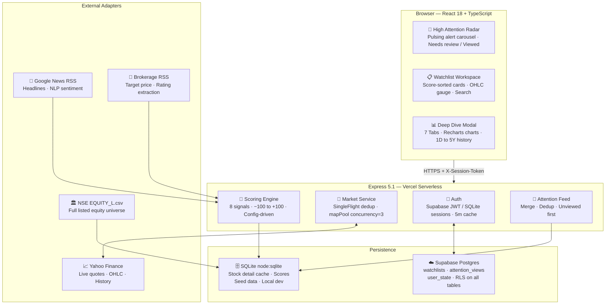

<div align="center">


<h1></h1>

<p><em>Not a flat price list. A ranked, scored, stateful attention radar for NSE investors.</em></p>

<p>
  <a href="https://nazara-smart-stock-watchlist.vercel.app/"></a>
  
  
  
  
</p>

> **One question, every session:** *"Which stocks in my watchlist actually need my attention right now?"*

</div>

---

## Why Nazara?

| Without Nazara | With Nazara |
|---|---|
| 10+ tabs — quotes, news, charts | One ranked feed of what matters now |
| Manual refresh every few minutes | Auto-poll with honest `LIVE / DELAYED / STALE` labels |
| Flat green/red list, no context | Score-sorted cards (−100 to +100) with signal breakdown |
| No memory of what you reviewed | Stateful `Needs review` vs `Viewed` per alert |
| Delayed quotes hiding as real-time | Dual-timestamp audit: `marketTimestamp` vs `receivedAt` |

---

## Architecture



---

## Data Quality — 6-State Truth Model

Every quote carries **two timestamps**: `marketTimestamp` (exchange time) and `receivedAt` (when Nazara got it). This prevents stale data from masquerading as live.

| Badge | Status | When It Fires |
|---|---|---|
| 🟢 `LIVE` | Fresh real-time | Market OPEN · age < 120s · lag < 20s |
| 🟡 `DELAYED` | Behind live | Market OPEN · provider lag > 20s |
| 🔵 `MARKET_CLOSED` | After-hours LTP | Outside 09:15–15:30 IST |
| 🟠 `STALE` | Cached fallback | Upstream failure — last verified quote served |
| 🔴 `UNAVAILABLE` | Bad payload | Zero/negative price or malformed OHLC |
| 🩸 `CONFLICT` | Timestamp regression | New quote older than stored quote |

---

## Scoring Engine — (−100 to +100)

```
Score = clamp( Σ of 8 signal points,  −100,  +100 )
```

| Signal | Max ± Pts | How |
|---|---|---|
| 📈 Price Movement | 25 | Piecewise: 2%→10p · 5%→20p · 10%→25p from open. Circuit hit = instant 25. |
| 🔊 Volume vs 30d Avg | 20 | 10%→5p · 20%→10p · 50%→15p · 100%→20p above avg |
| 💰 Earnings Surprise | 15 | Beat/miss vs analyst consensus |
| 📰 News Sentiment | 15 | Keyword NLP across 6 RSS headlines |
| 📊 Technical Indicators | 10 | RSI · MACD · Moving average composite |
| 🏦 Analyst Rating | 5 | Upgrade +5 · Downgrade −5 · Initiation +2 |
| 🏢 Corporate Action | 5 | Dividend · Split · Bonus · Buyback · Block deal |
| 👤 User Event | 5 | Portfolio / watchlist-specific triggers |

**Score tiers:** `Critical Neg` → `Strong Neg` → `Mild Neg` → `Neutral` → `Mild Pos` → `Strong Pos` → `Exceptional Pos`

> Weights live in `config/scoringConfig.json` — tunable without code changes.

---

## Key Features

**🔴 High Attention Radar** — Pulsing animated header. Top 4 alert cards ranked by score, color-coded by tone, with `Needs review` / `Viewed` chips. Clicking a card opens the deep dive and auto-marks it viewed. A stock re-arms to `Needs review` automatically when a newer catalyst fires.

**📋 Smart Watchlists** — Multiple named lists per user. Stocks auto-sorted by score. Predictive NSE search adds stocks with one click. OHLC intraday gauge with smart label collision avoidance.

**📊 7-Tab Deep Dive** — Overview chart (1D/1W/1M/3M/1Y/5Y) · Fundamentals · Brokerage & Targets (GS, MS, Jefferies, CLSA, Citi, Nomura…) · Concall tone diff · Holdings · News & Sentiment · Corporate Actions.

**⚡ Resilient Market Service** — `SingleFlight` dedup (N concurrent requests for same symbol = 1 Yahoo fetch). `mapPool` caps parallel fetches at configurable concurrency. Last known quote retained on failure.

---

## Project Structure

```
nazara/
├── api/                    # Vercel serverless entrypoints
├── config/
│   └── scoringConfig.json  # Scoring weights — edit without code changes
├── server/
│   ├── adapters/           # Yahoo Finance · News RSS · Brokerage · NSE CSV
│   ├── market/             # quoteValidator · session clock · singleFlight
│   ├── scoringEngine.js    # computeScore() — 8 signals, piecewise interp
│   ├── supabaseStore.js    # Supabase REST + Auth wrappers
│   └── server.js           # Express app — all routes + bootstrap + feed
├── src/
│   ├── App.tsx             # Full React app (all components, 1232 lines)
│   ├── api.ts              # Typed fetch client
│   └── types.ts            # TypeScript interfaces
├── supabase/
│   └── schema.sql          # Postgres DDL + RLS policies
└── tests/                  # quoteValidator + singleFlight unit tests
```

---

## Tech Stack

| Layer | Tech |
|---|---|
| Frontend | React 18 · TypeScript · Vite 7 · Recharts · Lucide React |
| Backend | Node.js ≥24 · Express 5.1 |
| Local DB | `node:sqlite` (DatabaseSync — zero config) |
| Cloud DB | Supabase Postgres 15 + Auth + RLS |
| Market Data | Yahoo Finance Chart API |
| News / Brokerage | Google News RSS with regex extraction |
| Deployment | Vercel Serverless (60s max duration) |

---

## Quick Start

```powershell
git clone https://github.com/Sejal707/Nazara-Smart-Stock-Watchlist-.git
cd "Nazara-Smart-Stock-Watchlist-"
npm.cmd install
npm.cmd run dev          # → http://localhost:5173
```

First login creates your account automatically and seeds a Starter Watchlist.

**Key env vars** (all optional for local SQLite dev):

```env
SUPABASE_URL=               # Required for production
SUPABASE_ANON_KEY=
SUPABASE_SERVICE_ROLE_KEY=  # Server-only, never expose to client
MARKET_DATA_STALE_AFTER_MS=120000
MARKET_DATA_DELAYED_AFTER_MS=20000
VITE_CLIENT_POLL_INTERVAL_MS=30000
```

---

## Deploy to Vercel

1. Push to GitHub → Import at [vercel.com/new](https://vercel.com/new)
2. Set: **Framework = Vite · Build = `npm run build` · Output = `dist`**
3. Add Supabase env vars in Vercel dashboard
4. Deploy → verify at `/api/health`

Run `supabase/schema.sql` in your Supabase SQL Editor first to create all tables and RLS policies.

---

## Testing

```powershell
npm.cmd run check    # TypeScript check
npm.cmd test         # Quote validator + SingleFlight unit tests
npm.cmd run build    # Build verification
```

---

<div align="center">

Built by [Sejal Sharma](https://github.com/Sejal707) &nbsp;·&nbsp; *Nazara — because every session deserves a clear view.*

[](https://nazara-smart-stock-watchlist.vercel.app/)

</div>
