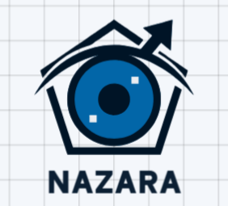
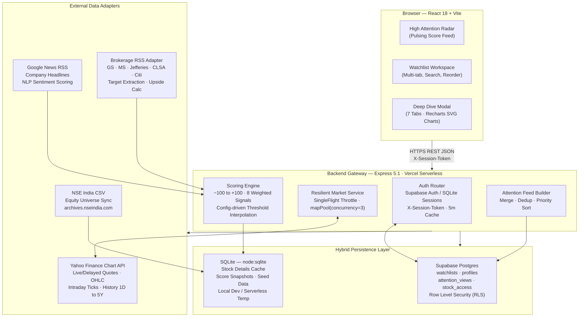
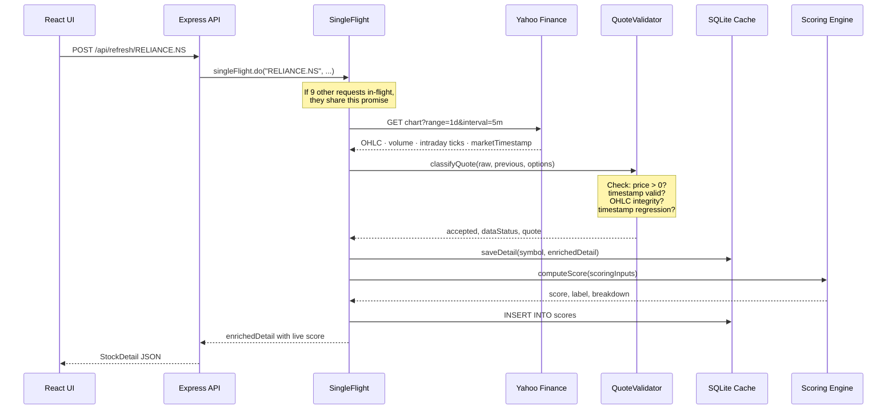
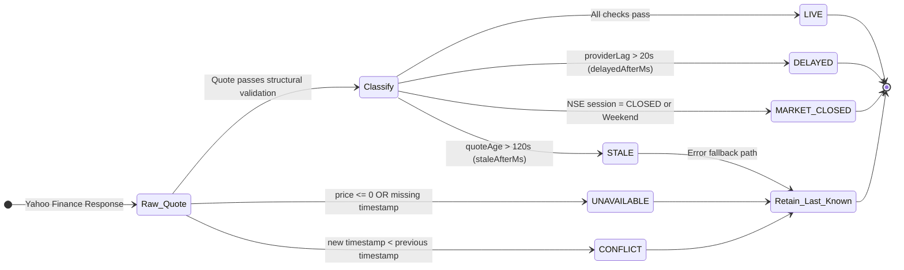
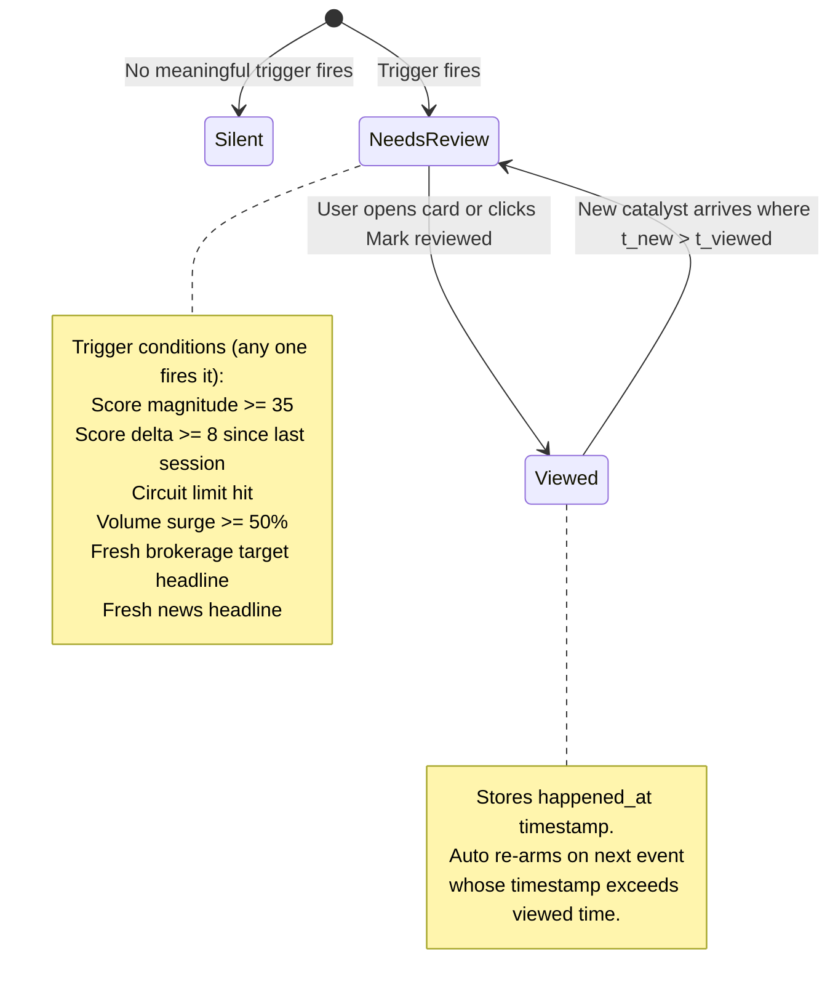

<div align="center">

<!-- ANIMATED BANNER -->


<h1>
  
</h1>

<p>
  <em>A bird's-eye command center for NSE equity investors.<br/>
  Not another flat price list — a ranked, scored, stateful attention radar.</em>
</p>

<!-- BADGES ROW 1 -->
<p>
  <a href="https://nazara-smart-stock-watchlist.vercel.app/" target="_blank">
    
  </a>
  
  
  
</p>

<!-- BADGES ROW 2 -->
<p>
  
  
  
  
</p>

<!-- BADGES ROW 3 -->
<p>
  
  
  
  
</p>

<br/>

> **One Question. Every Session.**
>
> *"Which stocks in my watchlist actually need my attention right now?"*

</div>

---

## Table of Contents

- [Why Nazara?](#-why-nazara)
- [Architecture](#-architecture)
- [Data Quality Model — 6-State Truth](#-data-quality-model--6-state-truth)
- [The Scoring Engine (−100 to +100)](#-the-scoring-engine-100-to-100)
- [Attention Feed State Machine](#-attention-feed-state-machine)
- [Feature Breakdown](#-feature-breakdown)
- [Project Structure](#-project-structure)
- [Tech Stack](#-tech-stack)
- [Environment Variables](#-environment-variables)
- [Quick Start — Local Dev](#-quick-start--local-dev)
- [Production — Supabase + Vercel](#-production--supabase--vercel)
- [Testing](#-testing)
- [Performance Notes](#-performance-notes)

---

## Why Nazara?

Most retail investors track 20+ stocks across fragmented dashboards:

| The Old Way | The Nazara Way |
|---|---|
| 10–15 browser tabs for quotes, news, charts | One ranked feed of stocks that matter right now |
| Refreshing manually to check if prices moved | Auto-polling with honest `LIVE / DELAYED / STALE` labels |
| Flat green/red percentage lists with no context | Score-ranked cards (−100 to +100) with signal breakdown |
| No memory of what you have already reviewed | Stateful `Needs review` vs `Viewed` attention status |
| Confusing delayed quotes dressed as real-time data | Dual-timestamp audit trail — `marketTimestamp` vs `receivedAt` |
| Zero awareness of brokerage target changes | Auto-extracted foreign brokerage targets from public headlines |

---

## Architecture

### System Topology



---

### Data Flow — Quote Lifecycle



---

### Attention Feed — Event Processing Pipeline

```mermaid
flowchart LR
    A["User Session Starts\nGET /api/bootstrap"] --> B["Fetch Watchlist Symbols"]
    B --> C["Refresh All Quotes\nmapPool concurrency=3"]
    C --> D["attentionFeed()"]

    subgraph SIGNALS["Signal Collection per Stock"]
        E1["Score Magnitude\n|score| >= 35"]
        E2["Score Delta\nDelta >= 8 since last visit"]
        E3["Fresh News\nnewDate > lastVisited"]
        E4["Fresh Brokerage\ntarget update detected"]
        E5["Price Spike\n|percentFromOpen| >= 2%"]
        E6["Volume Surge\nvolumeVsAvg >= 50%"]
        E7["Circuit Trigger\nhitUpperCircuit or hitLowerCircuit"]
    end

    D --> SIGNALS
    SIGNALS --> F["hasMeaningfulEvent()"]
    F -->|Triggered| G["Build Attention Item\nwith headline + reasons"]
    F -->|Silent| H["Skip Stock"]

    G --> I["mergeAttentionItems()\nDedup by symbol\nSort: Unviewed first, then |score| DESC"]
    I --> J["mustLook array (max 10)"]
    J --> K["High Attention Radar in Browser"]
```



---

## Data Quality Model — 6-State Truth

Nazara never lies about data freshness. Every quote carries a **dual-timestamp audit trail**:

- `marketTimestamp` — The exchange time stamped by Yahoo Finance for the market quote
- `receivedAt` — The UTC moment Nazara's backend received and processed the payload



| Status | Condition |
|---|---|
| `LIVE` | Market OPEN · quote age < 120s · provider lag < 20s |
| `DELAYED` | Market OPEN · provider lag > 20s |
| `MARKET_CLOSED` | NSE session outside 09:15–15:30 IST |
| `STALE` | Upstream failure — last known quote served |
| `UNAVAILABLE` | Malformed OHLC, zero/negative price |
| `CONFLICT` | Timestamp regression detected |

### NSE Market Session Clock (IST / Asia/Kolkata)

```
 00:00 ──────────────────────────────────────────────────── 23:59
        │09:00│09:15│              15:30│16:00│
        ├─────┼─────┼───────────────────┼─────┤
 CLOSED │ PRE │          OPEN           │POST │ CLOSED
        └─────┴─────┴───────────────────┴─────┘
```

---

## The Scoring Engine (−100 to +100)

Each stock receives a composite attention score computed via **piecewise linear interpolation** across 8 independent market signals, clamped to [−100, +100]:

```
Score = clamp( sum of Points_1 through Points_8,  −100,  +100 )
```

### Signal Contribution Matrix

```
+--------------------------+-----------+-----------------------------------------------------------+
| Signal                   | Max Pts   | Calculation                                               |
+--------------------------+-----------+-----------------------------------------------------------+
| Price Movement           |   +/- 25  | 2% -> 10p, 5% -> 20p, 10% -> 25p (from day open)        |
|                          |           | Circuit breaker hit -> instant +/- 25 pts                 |
+--------------------------+-----------+-----------------------------------------------------------+
| Volume vs 30d Avg        |   +/- 20  | 10%->5p, 20%->10p, 50%->15p, 100%->20p above avg         |
+--------------------------+-----------+-----------------------------------------------------------+
| Earnings Surprise        |   +/- 15  | Beat/miss vs analyst consensus. Quarterly data.           |
+--------------------------+-----------+-----------------------------------------------------------+
| News Sentiment           |   +/- 15  | RSS keyword NLP, aggregate across 6 headlines             |
+--------------------------+-----------+-----------------------------------------------------------+
| Technical Indicators     |   +/- 10  | RSI, MACD divergence, moving average crossovers           |
+--------------------------+-----------+-----------------------------------------------------------+
| Analyst Rating Change    |   +/-  5  | Upgrade +5, Downgrade -5, New Coverage initiation +2      |
+--------------------------+-----------+-----------------------------------------------------------+
| Corporate Action         |   +/-  5  | Dividend, Split, Bonus, Buyback, Block Deal               |
+--------------------------+-----------+-----------------------------------------------------------+
| User Event Trigger       |   +/-  5  | Portfolio allocation events, watchlist-specific signals   |
+--------------------------+-----------+-----------------------------------------------------------+
                                                       TOTAL MAX = 100
```

### Score Tier Labels

```
 -100   -80     -40      -10    +10      +40       +80  +100
  +------+--------+---------+------+--------+----------+----+
  | CRIT |STRONG  |  MILD   | NEUT |  MILD  |  STRONG  |EXCEP
  | NEG  |  NEG   |   NEG   |  RAL |   POS  |   POS    | POS
  +------+--------+---------+------+--------+----------+----+
```

| Range | Label |
|---|---|
| `+80` to `+100` | Exceptional Positive — Breakout / Circuit breaker hit |
| `+40` to `+79` | Strong Positive — High momentum, significant catalyst |
| `+10` to `+39` | Mild Positive — Moderate upward signal |
| `−9` to `+9` | Neutral — No meaningful change |
| `−39` to `−10` | Mild Negative — Moderate downward signal |
| `−79` to `−40` | Strong Negative — Broad sell-off signal |
| `−100` to `−80` | Critical Negative — Breakdown / Lower circuit |

---

## Attention Feed State Machine

The **High Attention Radar** tracks which stocks have changed significantly since your last session:



---

## Feature Breakdown

### High Attention Radar
The home screen is not a list — it is a **signal-ranked alert carousel**:
- Pulsing CSS radar dot animation on the section header
- Cards color-coded by score tone (positive / mild-positive / neutral / mild-negative / negative)
- `Needs review` badge (bright) vs `Viewed` badge (muted)
- Score delta inline: `score +14 since last opened`
- Click any card to jump directly to the full stock deep dive

### Smart Watchlist Workspace
- Multi-named watchlists per user — Create / Rename / Delete
- Stocks auto-sorted by composite score (highest attention first)
- NSE-focused typeahead search with instant add
- Stocks already in the watchlist are filtered from search results

### OHLC Anti-Collision Gauge

Each stock card shows an interactive intraday price range slider with smart label collision avoidance:

```
  Low          Open    Current       High
   o--------------o--------o-----------o
   |              |        |           |
1,180          1,210   1,236.40     1,255
```

The collision avoidance engine sorts markers by pixel position and uses a multi-lane algorithm to prevent overlapping labels — even when Low, Open, and Current are within a tight price band.

### 7-Tab Stock Deep Dive

| Tab | Contents |
|---|---|
| **Overview** | Interactive area chart (1D/1W/1M/3M/1Y/5Y) with SVG gradient fills + full score breakdown panel |
| **Fundamentals** | Annual and Quarterly P&L: Revenue Cr, Profit Cr, YoY%, QoQ%, Earnings surprise% |
| **Brokerage & Targets** | Median target price, upside%, and individual ratings from Goldman Sachs, Morgan Stanley, Jefferies, CLSA, Citi, Nomura, UBS, BofA |
| **Concall** | Management call summary bullets + Tone Diff table vs prior quarter |
| **Holdings** | Promoter / FII / DII shareholding % with QoQ trend arrows |
| **News & Sentiment** | RSS headline feed with polarity scores and source links |
| **Corporate Actions** | Dividend, bonus, split, buyback, block deal history |

### Price History Charts

| Range | Yahoo API Range | Interval |
|---|---|---|
| `1D` | `1d` | `5m` |
| `1W` | `5d` | `15m` |
| `1M` | `1mo` | `1d` |
| `3M` | `3mo` | `1d` |
| `1Y` | `1y` | `1d` |
| `5Y` | `5y` | `1wk` |

---

## Project Structure

```
nazara/
│
├── api/                          # Vercel serverless function entrypoints
│   ├── index.js                  # Root handler → server/server.js
│   └── [...path].js              # Wildcard catch → server/server.js
│
├── config/
│   ├── scoringConfig.json        # Scoring weights & tier labels (editable)
│   └── tickers.json              # Seed ticker list
│
├── server/
│   ├── adapters/
│   │   ├── marketDataAdapter.js  # Yahoo Finance Chart API + Resilient Service
│   │   ├── newsAdapter.js        # Google News RSS + sentiment scoring
│   │   ├── brokerageAdapter.js   # Foreign brokerage target extraction
│   │   └── listedStocksAdapter.js# NSE EQUITY_L.csv ingestion
│   │
│   ├── market/
│   │   ├── quoteValidator.js     # 6-state data quality classifier
│   │   ├── session.js            # NSE market hours (IST timezone)
│   │   └── singleFlight.js       # SingleFlight + mapPool concurrency
│   │
│   ├── config.js                 # Env-driven runtime config
│   ├── db.js                     # SQLite migrations + auth + CRUD
│   ├── scoringEngine.js          # Scoring formula + interpolation
│   ├── seed.js                   # Database seeding runner
│   ├── seedData.js               # Stock detail templates + buildDetail()
│   ├── server.js                 # Express app + all API route handlers
│   └── supabaseStore.js          # Supabase REST + Auth wrappers
│
├── src/
│   ├── App.tsx                   # Full React app (1,232 lines)
│   ├── api.ts                    # Typed fetch client (all API calls)
│   ├── types.ts                  # TypeScript interfaces
│   ├── styles.css                # Glassmorphic custom CSS design system
│   └── main.tsx                  # React root
│
├── supabase/
│   └── schema.sql                # Postgres DDL + RLS policies
│
├── tests/
│   ├── quoteValidator.test.js    # Quote classification unit tests
│   └── singleFlight.test.js      # Concurrency throttle tests
│
├── scripts/
│   ├── dev.mjs                   # Concurrent dev: seed → server + vite
│   └── build.mjs                 # Production build script
│
├── index.html                    # Vite HTML entrypoint
├── vercel.json                   # Serverless function config + rewrites
├── vite.config.ts                # Vite build configuration
├── tsconfig.json                 # TypeScript compiler options
└── package.json                  # Scripts + dependencies
```

---

## Tech Stack

| Layer | Technology | Purpose |
|---|---|---|
| **Frontend** | React 18, TypeScript | Component UI + type safety |
| **Build Tool** | Vite 7 | Hot module reload + optimized bundles |
| **Charts** | Recharts 2.12 | Area charts with SVG gradients |
| **Icons** | Lucide React | Consistent icon set |
| **Styling** | Custom CSS | Glassmorphic design system |
| **Backend** | Express 5.1, Node ≥ 24 | REST API + serverless handler |
| **Local DB** | node:sqlite (DatabaseSync) | Zero-config embedded database |
| **Cloud DB** | Supabase Postgres 15 | Multi-user persistence + RLS |
| **Auth** | Supabase Auth Admin API | JWT-based user sessions |
| **Market Data** | Yahoo Finance Chart API | Real-time/delayed NSE quotes + history |
| **News** | Google News RSS | Stock-relevant headlines |
| **Brokerage** | Google News RSS (filtered) | Foreign analyst targets |
| **Universe** | NSE India EQUITY_L.csv | Full NSE stock listing |
| **Deployment** | Vercel Serverless | Edge-optimized API + static frontend |
| **Tests** | Node.js built-in test runner | Quote validator + concurrency tests |

---

## Environment Variables

Create a `.env` file in the project root:

```env
# Server port (local mode)
PORT=8787

# Market data quality thresholds
MARKET_DATA_STALE_AFTER_MS=120000      # 120 seconds -> STALE
MARKET_DATA_DELAYED_AFTER_MS=20000     # 20 seconds -> DELAYED
MARKET_DATA_CACHE_MS=0                 # 0 = no in-memory caching
MARKET_DATA_CONCURRENCY=3              # Worker pool size

# Frontend auto-refresh interval
VITE_CLIENT_POLL_INTERVAL_MS=30000     # 30 seconds

# Supabase (required for production, optional for local SQLite dev)
SUPABASE_URL=https://your-project.supabase.co
SUPABASE_ANON_KEY=eyJ...
SUPABASE_SERVICE_ROLE_KEY=eyJ...       # Server-only — never expose to client

# Optional: OpenAI for concall/news LLM summaries
OPENAI_API_KEY=sk-...                  # Falls back to deterministic seed summaries
```

---

## Quick Start — Local Dev

Uses built-in SQLite via node:sqlite. No cloud account required.

```powershell
# 1. Clone
git clone https://github.com/Sejal707/Nazara-Smart-Stock-Watchlist-.git
cd "Nazara-Smart-Stock-Watchlist-"

# 2. Install dependencies (Windows PowerShell)
npm.cmd install

# 3. Optional: copy and edit environment
copy .env.example .env

# 4. Start development server
# Runs: seed -> Express API on :8787 -> Vite HMR on :5173
npm.cmd run dev

# 5. Open the app
# http://localhost:5173
```

Default login: Create any username and password. The first login auto-creates the account and seeds a Starter Watchlist.

For a production-style local preview:

```powershell
npm.cmd run build       # Builds React into dist/
npm.cmd start           # Serves API + static at http://localhost:8787
```

---

## Production — Supabase + Vercel

### Step 1 — Set up Supabase

1. Go to [supabase.com](https://supabase.com) and create a new project.
2. Open **SQL Editor** in the Supabase dashboard.
3. Paste and run the contents of `supabase/schema.sql`.
4. Go to **Project Settings → API** and copy:
   - `Project URL` → `SUPABASE_URL`
   - `anon / public` key → `SUPABASE_ANON_KEY`
   - `service_role` key → `SUPABASE_SERVICE_ROLE_KEY`

### Step 2 — Deploy to Vercel

1. Push this repository to GitHub.
2. Go to [vercel.com/new](https://vercel.com/new) and import your GitHub repository.
3. Set the following settings:

```
Framework Preset:  Vite
Build Command:     npm run build
Output Directory:  dist
Install Command:   npm install
```

4. Add all environment variables in **Vercel Dashboard → Project → Settings → Environment Variables**.
5. Click Deploy.

### Verify Deployment

```
https://your-project.vercel.app/api/health
```

Expected response:

```json
{
  "ok": true,
  "service": "Nazara API",
  "persistence": {
    "mode": "supabase",
    "supabaseConfigured": true
  },
  "marketData": {
    "provider": "Yahoo Finance chart API"
  }
}
```

### Vercel Route Configuration (vercel.json)

```
/api/*   →  api/[...path].js  →  server/server.js   (60s max duration)
/*       →  dist/index.html   →  React SPA fallback
```

---

## Testing

```powershell
# Type check
npm.cmd run check

# Unit tests (Node built-in test runner)
npm.cmd test

# Production build verification
npm.cmd run build
```

Test coverage:
- `quoteValidator.test.js` — LIVE / DELAYED / STALE / MARKET_CLOSED / UNAVAILABLE / CONFLICT classification logic, timestamp regression detection
- `singleFlight.test.js` — Single-flight deduplication and mapPool concurrency enforcement

---

## Performance Notes

| Technique | How It Works |
|---|---|
| **SingleFlight Throttling** | Concurrent requests for the same symbol share one upstream Yahoo Finance fetch |
| **mapPool Worker Pool** | Watchlist batch refreshes limited to `MARKET_DATA_CONCURRENCY` parallel fetches |
| **Session Caching** | Supabase auth token validation cached for 5 minutes per warm function instance |
| **Fast Bootstrap** | `GET /api/bootstrap?refresh=0` reloads state instantly without re-fetching Yahoo |
| **Selective Refresh** | `GET /api/bootstrap?refresh=1` triggers live price refresh for all watchlist symbols |
| **No-Store Headers** | All `/api/*` responses set `Cache-Control: no-store` to prevent stale CDN caching |
| **Client Poll Interval** | Frontend auto-refreshes every `VITE_CLIENT_POLL_INTERVAL_MS` milliseconds (default 30s) |

Next scaling step: Add Upstash Redis for shared quote caching across Vercel function instances when multi-user traffic grows.

---

## Data Sources

| Source | Coverage | Limitation |
|---|---|---|
| Yahoo Finance Chart API | Live/delayed NSE quotes, OHLC, intraday ticks, price history | Unofficial public endpoint; subject to rate limits |
| Google News RSS | Company, sector, policy, and IPO headlines with links | Search-ranked only; paywalled content not scraped |
| Google News RSS (Brokerage) | Foreign broker ratings and target-price headlines | Public headlines only — no full brokerage reports |
| NSE India EQUITY_L.csv | Complete NSE listed equity universe | Synced when online; offline fallback uses seed list |
| Seed Cache | Earnings, concall, holdings, actions, technical signals | Demo-safe data shaped like real parsed outputs |
| Optional LLM (OpenAI) | Concall and news summaries | Uses deterministic mock summaries when API key absent |

---

<div align="center">

Built by [Sejal Sharma](https://github.com/Sejal707)

*Nazara — because every market session deserves a clear view.*

[](https://nazara-smart-stock-watchlist.vercel.app/)

</div>

